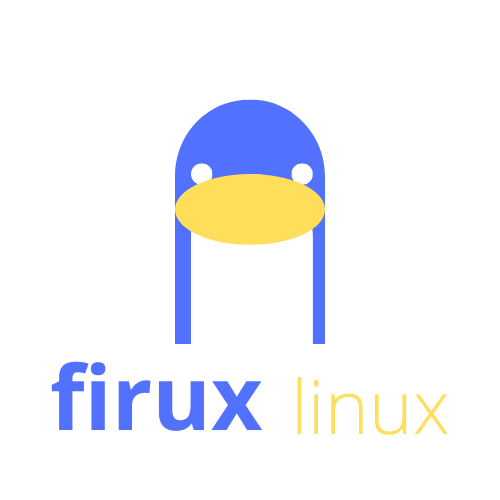

# Firux Linux (fxlx)

## What is Firux Linux?

Firux Linux (fxlx) is an upgrade-oriented operating system designed to enhance and update Arch Linux-based systems. Whether you're a novice user or an experienced programmer, Firux Linux offers a highly configurable environment that can be tailored to your needs.

### Key Features

- **Upgrade Arch-based OS:** Firux Linux enhances and keeps your Arch-based OS up to date.
- **Custom Shell (xsh):** An improved shell based on zsh with custom commands like `redpak`, `pakman`, and `show`.
- **Package Managers:** Utilizes `pacman`, `pakman`, and `redpak` (for the `red` version).
- **FLUPI Installation Method:** Install Firux Linux as a customization layer on top of a base OS.
- **Documentation:** Comprehensive documentation available, with source code exploration encouraged.

## Installation

Please refer to the [INSTALL.md](./INSTALL.md) for detailed installation instructions.

## License

Firux Linux is licensed under the Wissen-Open-License (WOL). See [LICENSE.md](./LICENSE.md) for more information.

## Contributing

We welcome contributions from everyone. Please read the [CONTRIBUTING.md](./CONTRIBUTING.md) to get started.

## Get in Touch

- **GitHub:** [Firux Linux](https://github.com/wissendrust/Firux-linux)
- **X (Twitter):** [Firux Linux](https://x.com/firux_linux)
